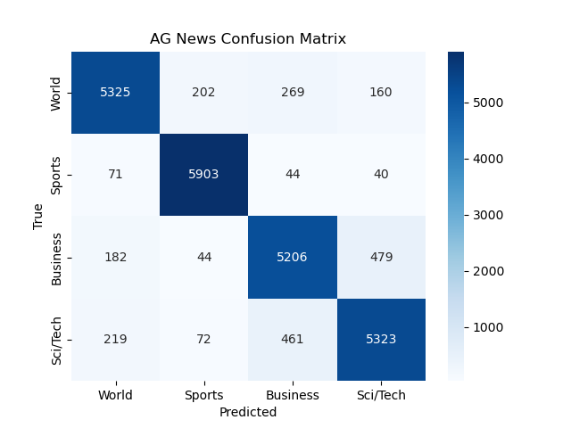

# AG News Text Classification — TF-IDF + Logistic Regression

## Project Overview
This project demonstrates a **text classification pipeline** using the [AG News dataset](https://www.kaggle.com/datasets/amananandrai/ag-news-classification-dataset).  
The goal is to automatically classify news articles into **four categories**:
- World
- Sports
- Business
- Science/Technology

This project implements a **classic NLP workflow** using:
- **TF-IDF vectorization** for text feature extraction
- **Logistic Regression** for supervised classification

---

## Objectives
- Understand how to preprocess and vectorize text
- Train and evaluate a machine learning model on textual data
- Build a lightweight, interpretable baseline model before using deep learning

---

## Dataset
- **Dataset:** AG News Dataset  
- **Description:** Each record contains a short news title and description, labeled with one of four topics  
- **Labels:**
  - 0 → World  
  - 1 → Sports  
  - 2 → Business  
  - 3 → Science/Tech  

The dataset can be accessed automatically via the `datasets` library from Hugging Face.

---

## Example Output

After running the `NTC` class (`python NTC.py`), the model produces the following evaluation metrics:

**Classification Report:**

| Class       | Precision | Recall | F1-Score | Support |
|------------|-----------|--------|----------|--------|
| World      | 0.92      | 0.89   | 0.91     | 5956   |
| Sports     | 0.95      | 0.97   | 0.96     | 6058   |
| Business   | 0.87      | 0.88   | 0.88     | 5911   |
| Sci/Tech   | 0.89      | 0.88   | 0.88     | 6075   |
| **Accuracy**   | | | 0.91     | 24000  |
| **Macro Avg**  | 0.91      | 0.91   | 0.91     | 24000  |
| **Weighted Avg** | 0.91  | 0.91   | 0.91     | 24000  |

**Confusion Matrix Visualization:**

> The heatmap shows how many articles in each category were correctly classified versus misclassified.

