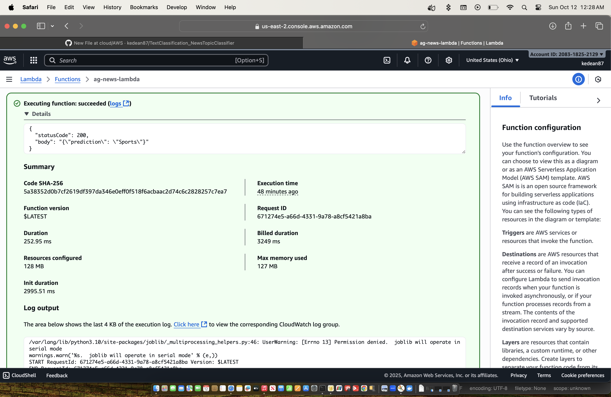

# AG News Lambda - News Topic Classification

This repository contains a Python-based news topic classification model deployed as a **Docker container on AWS Lambda**. It classifies news headlines into four categories: **World, Sports, Business, Sci/Tech**.  

The project demonstrates end-to-end deployment of a machine learning model to a serverless environment using **Docker**, **AWS Lambda**, and **AWS ECR**.

---

## Challenges Faced
1. **API Gateway not suitable for large ML models**  
   - Initially, we attempted to deploy the model using **API Gateway + Lambda**. However, the combined memory and payload size limits of AWS Lambda prevented the model from loading successfully. This approach was not feasible for our use case.

2. **Containerized Lambda deployment**  
   - To overcome memory limitations and simplify dependency management, we switched to **containerizing the deployment**. Using Docker allowed us to package the model, vectorizer, and Python dependencies together, providing full control over the environment and memory allocation.

3. **Flask not compatible with Lambda**  
   - Lambda requires a `lambda_handler` entrypoint, not a web server.

4. **AWS Lambda Container Architecture**  
   - Lambda defaulted to `x86_64` while local builds were sometimes `arm64`, causing `Runtime.InvalidEntrypoint` errors.

5. **Invalid image media type**  
   - OCI manifest issues caused Lambda to reject the container image. Explicitly building with `--platform linux/amd64` resolved this.

6. **UTF-8 encoding for payloads**  
   - The AWS CLI expects JSON payloads in UTF-8. ASCII payloads caused `InvalidRequestContentException`.

7. **Python dependency issues**  
   - Some runtime libraries (e.g., `aws-lambda-ric`) were missing or version mismatched. Using the official AWS Lambda Python base image helped.

8. **Timeout issues**  
   - The default Lambda timeout was too short (3 seconds) for the model load + prediction. Increasing timeout resolved `Sandbox.Timedout` errors.

---

## Step-by-Step Deployment

### 1. Prepare the Lambda Function
Create `lambda_function.py`:

### 2. Create Requirements
Create `requirements.txt`

### 3. Dockerize the function
Create `Dockerfile`

### 4. Build Docker Image
```docker build --platform linux/amd64 -t ag-news-lambda .```

### 5. Test Locally
from one terminal, execute:
```docker run -p 9000:8080 ag_news_lambda```

from another terminal, execute:
```curl -XPOST "http://localhost:9000/2015-03-31/functions/function/invocations" -d '{"text":"The stock market is up today."}'```

### 6. Push Docker Image to AWS ECR
```bash
aws ecr get-login-password --region us-east-2 | docker login --username AWS --password-stdin <your_account_id>.dkr.ecr.us-east-2.amazonaws.com

docker tag ag-news-lambda:latest <your_account_id>.dkr.ecr.us-east-2.amazonaws.com/ag-news-lambda:latest

docker push <your_account_id>.dkr.ecr.us-east-2.amazonaws.com/ag-news-lambda:latest```
```
### 7. Create Lambda Function with Container
```bash
aws lambda create-function \
  --function-name ag-news-lambda \
  --package-type Image \
  --code ImageUri=<your_account_id>.dkr.ecr.us-east-2.amazonaws.com/ag-news-lambda:latest \
  --role arn:aws:iam::<your_account_id>:role/lambda-execution-role-ag-news \
  --region us-east-2
```
### 8. Invoke the Lambda Function
```bash
aws lambda invoke \
  --function-name ag-news-lambda \
  --payload '{"text":"NASA launches new satellite"}' \
  response.json \
  --cli-binary-format raw-in-base64-out \
  --region us-east-2
```
---



> Showing that the test can be run from the AWS console as well.

---

## Lessons Learned

- Lambda container architecture must match Docker build platform (--platform linux/amd64 or arm64).
- UTF-8 JSON payloads are mandatory for AWS Lambda CLI invocations.
- Dependencies must be compatible with the Lambda base image.
- Testing locally inside the container is crucial before pushing to ECR.
- Timeout and memory settings can affect containerized ML model execution.


